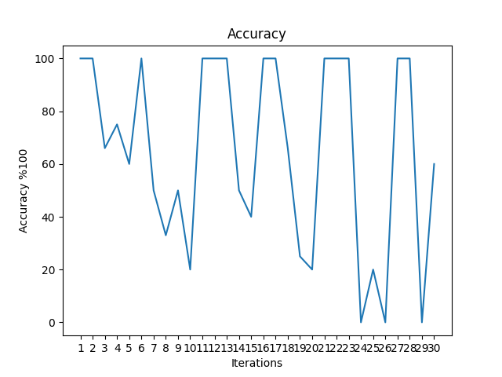
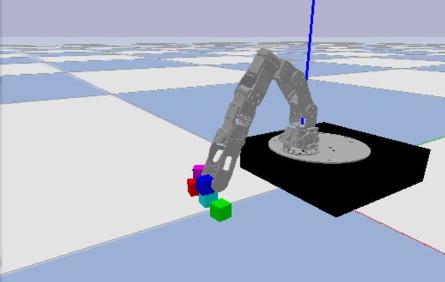

# Pre-requisites

Mesh files are large and not version-controlled. You can download them [here](https://sumailsyrmy.sharepoint.com/personal/gkatz01_syr_edu/_layouts/15/onedrive.aspx?id=%2Fpersonal%2Fgkatz01%5Fsyr%5Fedu%2FDocuments%2Fmeshes%2Ezip&parent=%2Fpersonal%2Fgkatz01%5Fsyr%5Fedu%2FDocuments&ga=1) (you'll need to be logged into your SU OneDrive account for access). Then, extract the zip archive into a sub-directory of this repository named "meshes".

You also need to install the [PyBullet](https://pybullet.org/wordpress/) simulator.

# s25rmp: Task and Motion Planning for Robotic Box Placement

## Overview

This project was developed as part of the CIS700: Robotic Motion Planning course. The goal is to use Task and Motion Planning (TAMP) techniques to place colored boxes into their designated target locations using a simulated robotic arm in the PyBullet physics engine.

The robot must account for both position and orientation constraints while executing motion primitives computed via inverse kinematics. Evaluation metrics include accuracy of placement and errors in orientation and position.

## Project Objective

- **Task**: Move boxes from their initial locations to pre-assigned goal regions using a robotic manipulator.
- **Methodology**: Use forward and inverse kinematics, orientation and joint constraints, and simulation-based validation.
- **Tools**: PyBullet for physics simulation and visualization, custom IK/FK solvers in Python.

## Prerequisites

Ensure the following are installed:

- Python 3.7+
- [PyBullet](https://pybullet.org/wordpress/)
- NumPy
- Matplotlib

## Running the Project
After installing dependencies and downloading meshes, you can run the following scripts:

## Run the Simulation
> python submission.py

## Project Structure

s25rmp-main/  
│  
├── simulation.py      &nbsp; &nbsp; &nbsp; &nbsp; &nbsp; &nbsp; &nbsp; &nbsp; &nbsp; &nbsp; &nbsp; &nbsp; &nbsp; &nbsp; &nbsp;   # Launches PyBullet and simulates TAMP  
├── tamp.py         &nbsp; &nbsp; &nbsp; &nbsp; &nbsp; &nbsp; &nbsp; &nbsp;  &nbsp; &nbsp; &nbsp; &nbsp;  &nbsp; &nbsp; &nbsp; &nbsp;  &nbsp; &nbsp; &nbsp;     # Task and Motion Planning logic  
├── inverse_kinematics.py &nbsp; &nbsp; &nbsp; &nbsp; &nbsp; &nbsp; &nbsp; &nbsp; # Inverse kinematics with constraints  
├── forward_kinematics.py &nbsp; &nbsp; &nbsp; &nbsp; &nbsp; &nbsp; &nbsp; &nbsp; # Computes frames from joint angles  
├── example.py           &nbsp; &nbsp; &nbsp; &nbsp; &nbsp; &nbsp; &nbsp; &nbsp; &nbsp; &nbsp; &nbsp; &nbsp; &nbsp; &nbsp; &nbsp; &nbsp; &nbsp;      # Demonstration and debug script  
├── evaluation.py       &nbsp; &nbsp; &nbsp; &nbsp; &nbsp; &nbsp; &nbsp; &nbsp; &nbsp; &nbsp; &nbsp; &nbsp; &nbsp; &nbsp;       # Plots and evaluates IK and TAMP results  
├── rotations.py        &nbsp; &nbsp; &nbsp; &nbsp; &nbsp; &nbsp; &nbsp; &nbsp; &nbsp; &nbsp; &nbsp; &nbsp; &nbsp; &nbsp; &nbsp;       # Rotation utilities (quaternions, etc.)  
├── submission.py     &nbsp; &nbsp; &nbsp; &nbsp; &nbsp; &nbsp; &nbsp; &nbsp; &nbsp; &nbsp; &nbsp; &nbsp; &nbsp;        # Final script for reproducible results  
├── poppy_ergo_jr.pybullet.urdf &nbsp; &nbsp;    # Robot model  
├── *.png         &nbsp; &nbsp; &nbsp; &nbsp; &nbsp; &nbsp; &nbsp; &nbsp; &nbsp; &nbsp; &nbsp; &nbsp; &nbsp; &nbsp; &nbsp; &nbsp; &nbsp; &nbsp; &nbsp; &nbsp;            # Visual result plots (see below)  
├── LICENSE       &nbsp; &nbsp; &nbsp; &nbsp; &nbsp; &nbsp; &nbsp; &nbsp; &nbsp; &nbsp; &nbsp; &nbsp; &nbsp; &nbsp; &nbsp; &nbsp; &nbsp; &nbsp;           # MIT License  
└── README.md     &nbsp; &nbsp; &nbsp; &nbsp; &nbsp; &nbsp; &nbsp; &nbsp; &nbsp; &nbsp; &nbsp; &nbsp; &nbsp; &nbsp; &nbsp;            # This file  

## Result Visualizations
The following figures represent the performance of the motion planner:

  
&nbsp; &nbsp; &nbsp; &nbsp; &nbsp; &nbsp; &nbsp; &nbsp; &nbsp; &nbsp; &nbsp; &nbsp; &nbsp; &nbsp; Distribution of task success rates over 30 simulations.

  
&nbsp; &nbsp; &nbsp; &nbsp; &nbsp; &nbsp; &nbsp; &nbsp; &nbsp;  Simulation snapshot showing stages of the block rearrangement process

## Notes
The robot used is the Poppy Ergo Jr, simulated via a custom URDF.

Optimization techniques used for IK include gradient-based solvers under PyTorch auto-differentiation.

Constraint functions ensure realistic and stable joint configurations.

